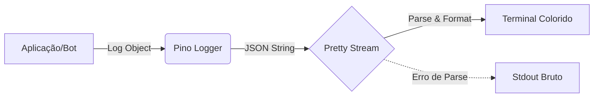

# 🎨 Aurora Logger: Um Logger Bonito e Funcional para Node.js
### *Logs coloridos e legíveis sem configuração complexa*

Cansado de logs JSON ilegíveis no seu terminal? Quer algo visual, colorido e fácil de implementar, sem configurar transportes complexos ou depender de ferramentas externas como `pino-pretty` em produção?

O **Aurora Logger** é um wrapper leve em torno do poderoso `pino`, adicionando formatação visual imediata com `chalk`. Ele foi desenhado especificamente para aplicações que precisam de feedback visual claro no console, como Bots de WhatsApp, CLI tools e scripts de automação.

---

## 🎯 Objetivos

1.  **Legibilidade Imediata**: Transformar JSONs brutos em linhas coloridas e iconizadas.
2.  **Zero Dependência de Build**: Funcionar nativamente sem precisar de pipes (`| pino-pretty`) no comando de start.
3.  **Feedback Visual**: Ícones intuitivos (ℹ, ⚠, ✖, ✔) para escaneamento rápido visual.
4.  **Compatibilidade Drop-in**: Pode ser injetado no `Baileys` ou qualquer lib que aceite uma interface de logger padrão.

---

## 📋 Pré-requisitos

-   **Node.js**: Versão 14 ou superior.
-   **Dependências**:
    -   `pino`: O core de alta performance.
    -   `chalk`: Para colorir o terminal (versão 4 para compatibilidade máxima com CommonJS).

```bash
npm install pino chalk@4
```

---

## 🛠️ Implementação Passo a Passo

### 1. O Arquivo `logger.js`

Crie um arquivo chamado `logger.js` na sua pasta de utilitários. Este arquivo configura o stream de saída e os interceptadores de log.

> **Nota**: O código completo está disponível no arquivo [`logger.js`](./logger.js) desta pasta.

### 2. Fluxo de Dados

O Aurora Logger intercepta a saída do Pino antes de ela ir para o `stdout`, aplica cores e formata datas.



---

## 💻 Como Usar

### Importação Básica

```javascript
const logger = require('./path/to/logger');

logger.info('Sistema iniciado com sucesso');
logger.error('Falha na conexão com o banco de dados');
```

### Helpers Visuais Exclusivos

Adicionamos métodos que não existem no Pino padrão para facilitar feedback de scripts:

```javascript
// ✅ Sucesso (Verde com Check)
logger.success('Arquivo salvo com sucesso!');

// ❌ Falha (Vermelho com X)
logger.fail('Não foi possível ler o arquivo de configuração.');
```

### Integrando com Baileys

O Aurora Logger possui o método `.child()`, permitindo que ele seja passado diretamente para a configuração do socket do Baileys:

```javascript
const sock = makeWASocket({
    logger: logger.child({ module: 'baileys' }), // <--- Aqui!
    // ... outras configs
});
```

---

## 🧪 Exemplo de Uso Executável

Para ver as cores em ação no seu terminal agora mesmo:

1.  Certifique-se de ter instalado as dependências (`npm install pino chalk@4`).
2.  Execute o script de teste incluído nesta pasta:

```bash
node test.js
```

O script [`test.js`](./test.js) irá gerar logs de todos os níveis (Info, Warn, Error) e demonstrar os helpers visuais.

---

## ❓ Troubleshooting

| Problema | Causa Provável | Solução |
| :--- | :--- | :--- |
| **Logs não coloridos** | O terminal não suporta cores ou `FORCE_COLOR=0`. | Verifique as configurações do seu terminal. Tente `FORCE_COLOR=1 node app.js`. |
| **Erro "require() of ES Module"** | Você instalou `chalk` v5+ (que é apenas ESM) em um projeto CommonJS. | Use `npm install chalk@4` para garantir compatibilidade com `require`. |
| **Logs duplicados** | Você pode estar usando `pino-pretty` no comando de start junto com este logger. | Remova `| pino-pretty` do seu script `start` no package.json. |

---

## 📚 Referências

-   [Documentação do Pino](https://getpino.io/)
-   [Chalk (Cores no Terminal)](https://www.npmjs.com/package/chalk)
-   [Baileys Logger Configuration](https://github.com/WhiskeySockets/Baileys)

---

### 🚀 Conclusão

Com o **Aurora Logger**, você elimina a "sujeira" visual dos logs JSON durante o desenvolvimento, mantendo a performance e estrutura do Pino. É a base perfeita para qualquer bot ou CLI que você venha a criar.

---
© 2026 Vincent AI Studios
